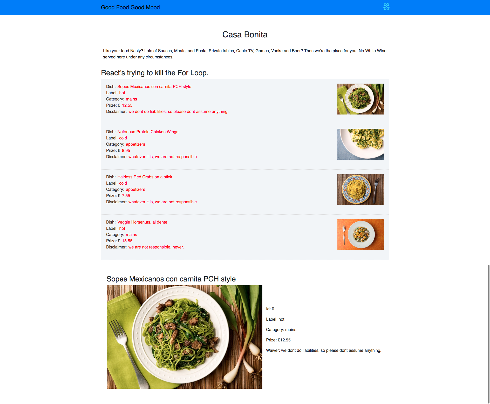

# con2 <kbd>ReactJS</kbd>
>[ReactJS]
> `practice round` - recreated from scratch single page app, with reactstrap comp top menu displaying four dishes being pulled from an object array imported into app component (parent comp)

- created react-app con2
- hidden files: manifest, service workers, test,js
- my naming convention: `app-file.js` files name, and `AppFile` for classes.
- using mix of bootstrap4, and reactstrap components
- created datajs class for a few menu items
- calling events at parent component in order to reach out within children components
- using state for parent and props for children
- app parent component, children within components folder in src


### notes
- about parent child components
- if you're using another comp for rendering then tha'll be your parent component
- If you're requiring a comp that should be a children comp.
- Elevating the state allows you to share down with children comp 
  easier.
- if you have some data, set the state in parent component and pass info to child
  component via props.


####  how to pass state

  ```
      //in app
      import {Dishes} from './shared/dish-data.js'
      ...
      constructor(props) {
        super(props);
        this.state = {
            dishes: Dishes
        };
      }//const
      ..
        within render() {
          <TopMenu dishes={this.state.dishes}> //now this is available as props
                                            //inside child comp which is called
                                            //TopMenu
        }

        // At Receiving End
        //-------------------
          const dishes = this.props.menuDishes.map((dish) => {
          // console.log('dish', dish);
          return (...
                  .....
          //render return:
          {dishes}
          //to change state
          -----------------
          //responding to a click event for ex
          then to a function and apply setState method
              this.setState({
                dishSelected: dish     //dish is the obj pass as arg in fn
              })

              //dishSelected was the initial value previously set to null like
              //this:

              this.state = {
                dishSelected: null
              };

              //also we want render dish details

              renderDish(dish) {
                if(dish !== null) {
                  return (
                      <div>
                        <h2>title...
                      </div>
                  );
                }
                else {
                  return(
                    <div></div>
                  );
                }
              }//renderDish
              //on return rendering code

              return (
                <div>...
                            {dishes}
                            ....
                            ..
                            {this.renderDish(this.state.dishSelected)}
              )/

```

<br/>



      
<br/>

### component lifecycle
- a react component goes through the following lifecycle stages:
  + `Mounting` after creation
  + `Updating` if view needs updated
  + `Unmounting` if comp no longer needed

- `important` here is that there are `several lifecycle methods` called by 
   react or i guess `available from react` at `different stages` within a `lifecycle`

### Mounting Lifecycle methods
- these methods are called when an instance of a component is being created and    inserted into:
  the DOM
- constructor
- getDerivedStateFromProps()
- render
- componentDidMount()

> `constructor` comp gets called first, `Render` method afterwards and
  `DidMount` last